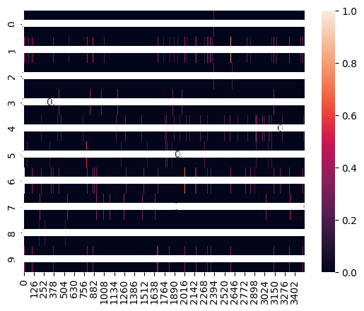
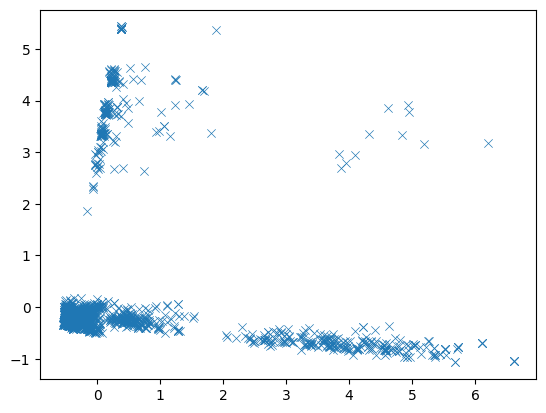

# Course Recommendation using Cosine Similarity

Cosine similarity is a commonly used similarity metric in machine learning and natural language processing. It measures the similarity between two vectors by computing the cosine of the angle between them. The two vectors are typically represented as lists of numerical values, and each element in the list corresponds to a different feature or dimension.


The cosine similarity metric is particularly useful for comparing text documents or word embeddings in natural language processing. In this context, each document or word is represented as a vector of numerical values, where each value represents the importance or frequency of a particular word or feature. By computing the cosine similarity between two vectors, we can determine how similar the two documents or words are based on the words they share in common.

The cosine similarity metric ranges from -1 to 1, with -1 indicating completely opposite vectors, 0 indicating vectors that are orthogonal (perpendicular) to each other, and 1 indicating identical vectors.

To calculate the cosine similarity between two vectors, we use the following formula:
$$\text{similarity}(\mathbf{x}, \mathbf{y}) = \frac{\mathbf{x} \cdot \mathbf{y}}{\|\mathbf{x}\|\|\mathbf{y}\|}$$

Then, we calculate the cosine distance between two vectors using the formula:
$$\text{distance}(\mathbf{x}, \mathbf{y}) = 1 - \text{similarity}(\mathbf{x}, \mathbf{y})$$

```python
# Load data analysis packages
import pandas as pd
import neattext.functions as nfx
```

```python
# Load ML packages
from sklearn.feature_extraction.text import CountVectorizer, TfidfVectorizer
from sklearn.metrics.pairwise import cosine_similarity, linear_kernel
from sklearn.decomposition import PCA
```

```python
# Load the CSV data
df = pd.read_csv("data/coursera_data.csv")
df.head()

```

<div>
<style scoped>
    .dataframe tbody tr th:only-of-type {
        vertical-align: middle;
    }

    .dataframe tbody tr th {
        vertical-align: top;
    }

    .dataframe thead th {
        text-align: right;
    }

</style>
<table border="1" class="dataframe">
  <thead>
    <tr style="text-align: right;">
      <th></th>
      <th>course_name</th>
      <th>university</th>
      <th>difficulty_level</th>
      <th>course_rating</th>
      <th>course_url</th>
      <th>course_description</th>
      <th>course_skills</th>
    </tr>
  </thead>
  <tbody>
    <tr>
      <th>0</th>
      <td>Write A Feature Length Screenplay For Film Or ...</td>
      <td>Michigan State University</td>
      <td>Beginner</td>
      <td>4.8</td>
      <td>https://www.coursera.org/learn/write-a-feature...</td>
      <td>Write a Full Length Feature Film Script  In th...</td>
      <td>Drama  Comedy  peering  screenwriting  film  D...</td>
    </tr>
    <tr>
      <th>1</th>
      <td>Business Strategy: Business Model Canvas Analy...</td>
      <td>Coursera Project Network</td>
      <td>Beginner</td>
      <td>4.8</td>
      <td>https://www.coursera.org/learn/canvas-analysis...</td>
      <td>By the end of this guided project, you will be...</td>
      <td>Finance  business plan  persona (user experien...</td>
    </tr>
    <tr>
      <th>2</th>
      <td>Silicon Thin Film Solar Cells</td>
      <td>�cole Polytechnique</td>
      <td>Advanced</td>
      <td>4.1</td>
      <td>https://www.coursera.org/learn/silicon-thin-fi...</td>
      <td>This course consists of a general presentation...</td>
      <td>chemistry  physics  Solar Energy  film  lambda...</td>
    </tr>
    <tr>
      <th>3</th>
      <td>Finance for Managers</td>
      <td>IESE Business School</td>
      <td>Intermediate</td>
      <td>4.8</td>
      <td>https://www.coursera.org/learn/operational-fin...</td>
      <td>When it comes to numbers, there is always more...</td>
      <td>accounts receivable  dupont analysis  analysis...</td>
    </tr>
    <tr>
      <th>4</th>
      <td>Retrieve Data using Single-Table SQL Queries</td>
      <td>Coursera Project Network</td>
      <td>Beginner</td>
      <td>4.6</td>
      <td>https://www.coursera.org/learn/single-table-sq...</td>
      <td>In this course you�ll learn how to effectively...</td>
      <td>Data Analysis  select (sql)  database manageme...</td>
    </tr>
  </tbody>
</table>
</div>

### Cleaning Data

As can be seen above, the `course_name` consists of many filler words like `and, or, the`. We don't want these filler words in our vectors. So, we use the `neattext` library to remove such words from our data.

```python
# Remove stop words from data
df['clean_course_name'] = df['course_name'].apply(nfx.remove_stopwords)
# Remove special characters
df['clean_course_name'] = df['clean_course_name'].apply(nfx.remove_special_characters)
df[['course_name','clean_course_name']]

```

<div>
<style scoped>
    .dataframe tbody tr th:only-of-type {
        vertical-align: middle;
    }

    .dataframe tbody tr th {
        vertical-align: top;
    }

    .dataframe thead th {
        text-align: right;
    }

</style>
<table border="1" class="dataframe">
  <thead>
    <tr style="text-align: right;">
      <th></th>
      <th>course_name</th>
      <th>clean_course_name</th>
    </tr>
  </thead>
  <tbody>
    <tr>
      <th>0</th>
      <td>Write A Feature Length Screenplay For Film Or ...</td>
      <td>Write Feature Length Screenplay Film Television</td>
    </tr>
    <tr>
      <th>1</th>
      <td>Business Strategy: Business Model Canvas Analy...</td>
      <td>Business Strategy Business Model Canvas Analys...</td>
    </tr>
    <tr>
      <th>2</th>
      <td>Silicon Thin Film Solar Cells</td>
      <td>Silicon Thin Film Solar Cells</td>
    </tr>
    <tr>
      <th>3</th>
      <td>Finance for Managers</td>
      <td>Finance Managers</td>
    </tr>
    <tr>
      <th>4</th>
      <td>Retrieve Data using Single-Table SQL Queries</td>
      <td>Retrieve Data SingleTable SQL Queries</td>
    </tr>
    <tr>
      <th>...</th>
      <td>...</td>
      <td>...</td>
    </tr>
    <tr>
      <th>3517</th>
      <td>Capstone: Retrieving, Processing, and Visualiz...</td>
      <td>Capstone Retrieving Processing Visualizing Dat...</td>
    </tr>
    <tr>
      <th>3518</th>
      <td>Patrick Henry: Forgotten Founder</td>
      <td>Patrick Henry Forgotten Founder</td>
    </tr>
    <tr>
      <th>3519</th>
      <td>Business intelligence and data analytics: Gene...</td>
      <td>Business intelligence data analytics Generate ...</td>
    </tr>
    <tr>
      <th>3520</th>
      <td>Rigid Body Dynamics</td>
      <td>Rigid Body Dynamics</td>
    </tr>
    <tr>
      <th>3521</th>
      <td>Architecting with Google Kubernetes Engine: Pr...</td>
      <td>Architecting Google Kubernetes Engine Production</td>
    </tr>
  </tbody>
</table>
<p>3522 rows × 2 columns</p>
</div>

```python
# Vectorize our Text
count_vect = CountVectorizer()
cv_mat = count_vect.fit_transform(df['clean_course_name'])

```

```python
# Dense Matrix
cv_mat.todense()
```

    matrix([[0, 0, 0, ..., 0, 0, 0],
            [0, 0, 0, ..., 0, 0, 0],
            [0, 0, 0, ..., 0, 0, 0],
            ...,
            [0, 0, 0, ..., 0, 0, 0],
            [0, 0, 0, ..., 0, 0, 0],
            [0, 0, 0, ..., 0, 0, 0]])

```python
df_cv_words = pd.DataFrame(cv_mat.todense(),columns=count_vect.get_feature_names_out())
df_cv_words.head()

```

<div>
<style scoped>
    .dataframe tbody tr th:only-of-type {
        vertical-align: middle;
    }

    .dataframe tbody tr th {
        vertical-align: top;
    }

    .dataframe thead th {
        text-align: right;
    }

</style>
<table border="1" class="dataframe">
  <thead>
    <tr style="text-align: right;">
      <th></th>
      <th>10</th>
      <th>10000</th>
      <th>101</th>
      <th>102</th>
      <th>1650</th>
      <th>17002000</th>
      <th>1760</th>
      <th>1910</th>
      <th>19621974</th>
      <th>1e</th>
      <th>...</th>
      <th>young</th>
      <th>your</th>
      <th>yourself</th>
      <th>youth</th>
      <th>yuan</th>
      <th>zap</th>
      <th>zcurve</th>
      <th>zero</th>
      <th>zoning</th>
      <th>zos</th>
    </tr>
  </thead>
  <tbody>
    <tr>
      <th>0</th>
      <td>0</td>
      <td>0</td>
      <td>0</td>
      <td>0</td>
      <td>0</td>
      <td>0</td>
      <td>0</td>
      <td>0</td>
      <td>0</td>
      <td>0</td>
      <td>...</td>
      <td>0</td>
      <td>0</td>
      <td>0</td>
      <td>0</td>
      <td>0</td>
      <td>0</td>
      <td>0</td>
      <td>0</td>
      <td>0</td>
      <td>0</td>
    </tr>
    <tr>
      <th>1</th>
      <td>0</td>
      <td>0</td>
      <td>0</td>
      <td>0</td>
      <td>0</td>
      <td>0</td>
      <td>0</td>
      <td>0</td>
      <td>0</td>
      <td>0</td>
      <td>...</td>
      <td>0</td>
      <td>0</td>
      <td>0</td>
      <td>0</td>
      <td>0</td>
      <td>0</td>
      <td>0</td>
      <td>0</td>
      <td>0</td>
      <td>0</td>
    </tr>
    <tr>
      <th>2</th>
      <td>0</td>
      <td>0</td>
      <td>0</td>
      <td>0</td>
      <td>0</td>
      <td>0</td>
      <td>0</td>
      <td>0</td>
      <td>0</td>
      <td>0</td>
      <td>...</td>
      <td>0</td>
      <td>0</td>
      <td>0</td>
      <td>0</td>
      <td>0</td>
      <td>0</td>
      <td>0</td>
      <td>0</td>
      <td>0</td>
      <td>0</td>
    </tr>
    <tr>
      <th>3</th>
      <td>0</td>
      <td>0</td>
      <td>0</td>
      <td>0</td>
      <td>0</td>
      <td>0</td>
      <td>0</td>
      <td>0</td>
      <td>0</td>
      <td>0</td>
      <td>...</td>
      <td>0</td>
      <td>0</td>
      <td>0</td>
      <td>0</td>
      <td>0</td>
      <td>0</td>
      <td>0</td>
      <td>0</td>
      <td>0</td>
      <td>0</td>
    </tr>
    <tr>
      <th>4</th>
      <td>0</td>
      <td>0</td>
      <td>0</td>
      <td>0</td>
      <td>0</td>
      <td>0</td>
      <td>0</td>
      <td>0</td>
      <td>0</td>
      <td>0</td>
      <td>...</td>
      <td>0</td>
      <td>0</td>
      <td>0</td>
      <td>0</td>
      <td>0</td>
      <td>0</td>
      <td>0</td>
      <td>0</td>
      <td>0</td>
      <td>0</td>
    </tr>
  </tbody>
</table>
<p>5 rows × 3602 columns</p>
</div>

```python
# Cosine Similarity Matrix
cosine_sim_mat = cosine_similarity(cv_mat)
```

```python
cosine_sim_mat
```

    array([[1.        , 0.        , 0.18257419, ..., 0.        , 0.        ,
            0.        ],
           [0.        , 1.        , 0.        , ..., 0.27216553, 0.        ,
            0.        ],
           [0.18257419, 0.        , 1.        , ..., 0.        , 0.        ,
            0.        ],
           ...,
           [0.        , 0.27216553, 0.        , ..., 1.        , 0.        ,
            0.        ],
           [0.        , 0.        , 0.        , ..., 0.        , 1.        ,
            0.        ],
           [0.        , 0.        , 0.        , ..., 0.        , 0.        ,
            1.        ]])

```python
# Use seaborn to generate heatmap
import seaborn as sns
sns.heatmap(cosine_sim_mat[0:10],annot=True)

```

    <Axes: >



```python
import matplotlib.pyplot as plt

# Perform PCA to reduce the dimensionality to 2
pca = PCA(n_components=2)
reduced_matrix = pca.fit_transform(cosine_sim_mat)

# Create a scatter plot of the reduced matrix
sns.scatterplot(x=reduced_matrix[:, 0], y=reduced_matrix[:, 1], marker='x')

# Label the points with the index of the corresponding item or document
# for i, (x, y) in enumerate(reduced_matrix):
#     plt.text(x, y, str(i))

# Show the plot
plt.show()
```



```python
df.head()

```

<div>
<style scoped>
    .dataframe tbody tr th:only-of-type {
        vertical-align: middle;
    }

    .dataframe tbody tr th {
        vertical-align: top;
    }

    .dataframe thead th {
        text-align: right;
    }

</style>
<table border="1" class="dataframe">
  <thead>
    <tr style="text-align: right;">
      <th></th>
      <th>course_name</th>
      <th>university</th>
      <th>difficulty_level</th>
      <th>course_rating</th>
      <th>course_url</th>
      <th>course_description</th>
      <th>course_skills</th>
      <th>clean_course_name</th>
    </tr>
  </thead>
  <tbody>
    <tr>
      <th>0</th>
      <td>Write A Feature Length Screenplay For Film Or ...</td>
      <td>Michigan State University</td>
      <td>Beginner</td>
      <td>4.8</td>
      <td>https://www.coursera.org/learn/write-a-feature...</td>
      <td>Write a Full Length Feature Film Script  In th...</td>
      <td>Drama  Comedy  peering  screenwriting  film  D...</td>
      <td>Write Feature Length Screenplay Film Television</td>
    </tr>
    <tr>
      <th>1</th>
      <td>Business Strategy: Business Model Canvas Analy...</td>
      <td>Coursera Project Network</td>
      <td>Beginner</td>
      <td>4.8</td>
      <td>https://www.coursera.org/learn/canvas-analysis...</td>
      <td>By the end of this guided project, you will be...</td>
      <td>Finance  business plan  persona (user experien...</td>
      <td>Business Strategy Business Model Canvas Analys...</td>
    </tr>
    <tr>
      <th>2</th>
      <td>Silicon Thin Film Solar Cells</td>
      <td>�cole Polytechnique</td>
      <td>Advanced</td>
      <td>4.1</td>
      <td>https://www.coursera.org/learn/silicon-thin-fi...</td>
      <td>This course consists of a general presentation...</td>
      <td>chemistry  physics  Solar Energy  film  lambda...</td>
      <td>Silicon Thin Film Solar Cells</td>
    </tr>
    <tr>
      <th>3</th>
      <td>Finance for Managers</td>
      <td>IESE Business School</td>
      <td>Intermediate</td>
      <td>4.8</td>
      <td>https://www.coursera.org/learn/operational-fin...</td>
      <td>When it comes to numbers, there is always more...</td>
      <td>accounts receivable  dupont analysis  analysis...</td>
      <td>Finance Managers</td>
    </tr>
    <tr>
      <th>4</th>
      <td>Retrieve Data using Single-Table SQL Queries</td>
      <td>Coursera Project Network</td>
      <td>Beginner</td>
      <td>4.6</td>
      <td>https://www.coursera.org/learn/single-table-sq...</td>
      <td>In this course you�ll learn how to effectively...</td>
      <td>Data Analysis  select (sql)  database manageme...</td>
      <td>Retrieve Data SingleTable SQL Queries</td>
    </tr>
  </tbody>
</table>
</div>

```python
# Get Course Index
course_indices = pd.Series(df.index,index=df['course_name']).drop_duplicates()
```

```python
course_indices

```

    course_name
    Write A Feature Length Screenplay For Film Or Television                 0
    Business Strategy: Business Model Canvas Analysis with Miro              1
    Silicon Thin Film Solar Cells                                            2
    Finance for Managers                                                     3
    Retrieve Data using Single-Table SQL Queries                             4
                                                                          ...
    Capstone: Retrieving, Processing, and Visualizing Data with Python    3517
    Patrick Henry: Forgotten Founder                                      3518
    Business intelligence and data analytics: Generate insights           3519
    Rigid Body Dynamics                                                   3520
    Architecting with Google Kubernetes Engine: Production                3521
    Length: 3522, dtype: int64

```python
def recommend_course(title,num_of_rec=10):
    idx = course_indices[title]
    scores = list(enumerate(cosine_sim_mat[idx]))
    sorted_scores = sorted(scores,key=lambda x:x[1],reverse=True)
    selected_course_indices = [i[0] for i in sorted_scores[1:]]
    selected_course_scores = [i[1] for i in sorted_scores[1:]]
    result = df['course_name'].iloc[selected_course_indices]
    rec_df = pd.DataFrame(result)
    rec_df['similarity_scores'] = selected_course_scores
    return rec_df.head(num_of_rec)

```

```python
recommend_course('Finance for Managers',20)

```

<div>
<style scoped>
    .dataframe tbody tr th:only-of-type {
        vertical-align: middle;
    }

    .dataframe tbody tr th {
        vertical-align: top;
    }

    .dataframe thead th {
        text-align: right;
    }

</style>
<table border="1" class="dataframe">
  <thead>
    <tr style="text-align: right;">
      <th></th>
      <th>course_name</th>
      <th>similarity_scores</th>
    </tr>
  </thead>
  <tbody>
    <tr>
      <th>419</th>
      <td>Finance for Non-Financial Managers</td>
      <td>0.816497</td>
    </tr>
    <tr>
      <th>181</th>
      <td>Construction Finance</td>
      <td>0.500000</td>
    </tr>
    <tr>
      <th>668</th>
      <td>How to finance your venture ?</td>
      <td>0.500000</td>
    </tr>
    <tr>
      <th>1236</th>
      <td>Behavioral Finance</td>
      <td>0.500000</td>
    </tr>
    <tr>
      <th>3431</th>
      <td>Innovative Finance: Hacking finance to change ...</td>
      <td>0.500000</td>
    </tr>
    <tr>
      <th>3448</th>
      <td>Finance for Startups</td>
      <td>0.500000</td>
    </tr>
    <tr>
      <th>646</th>
      <td>Finance for Non-Financial Professionals</td>
      <td>0.408248</td>
    </tr>
    <tr>
      <th>832</th>
      <td>Finance for Everyone: Decisions</td>
      <td>0.408248</td>
    </tr>
    <tr>
      <th>959</th>
      <td>Finance for Everyone Capstone Project</td>
      <td>0.408248</td>
    </tr>
    <tr>
      <th>1010</th>
      <td>Reinforcement Learning in Finance</td>
      <td>0.408248</td>
    </tr>
    <tr>
      <th>1164</th>
      <td>Corporate Finance Essentials</td>
      <td>0.408248</td>
    </tr>
    <tr>
      <th>1567</th>
      <td>Finance for Everyone: Debt</td>
      <td>0.408248</td>
    </tr>
    <tr>
      <th>1891</th>
      <td>Accounting and Finance for IT professionals</td>
      <td>0.408248</td>
    </tr>
    <tr>
      <th>1985</th>
      <td>Introduction to Finance: The Basics</td>
      <td>0.408248</td>
    </tr>
    <tr>
      <th>2068</th>
      <td>Principles of Sustainable Finance</td>
      <td>0.408248</td>
    </tr>
    <tr>
      <th>2082</th>
      <td>Finance for Non-Finance Professionals</td>
      <td>0.408248</td>
    </tr>
    <tr>
      <th>2851</th>
      <td>Finance for Everyone: Markets</td>
      <td>0.408248</td>
    </tr>
    <tr>
      <th>3110</th>
      <td>Finance For Everyone: Value</td>
      <td>0.408248</td>
    </tr>
    <tr>
      <th>306</th>
      <td>Blockchain, Cryptoassets, and Decentralized Fi...</td>
      <td>0.353553</td>
    </tr>
    <tr>
      <th>348</th>
      <td>On Strategy : What Managers Can Learn from Phi...</td>
      <td>0.353553</td>
    </tr>
  </tbody>
</table>
</div>

```python

```

```python

```
